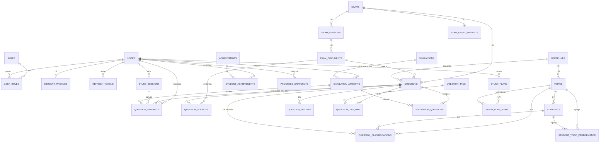

# Modelo Conceitual / ERD — VouPassar (TASK 2.1)

> Fonte: `AGENTS.md §11–13` (entidades esperadas, proveniência, tipos de questão),
> `docs/architecture.md §4`, evidências da Fase 1 (`docs/provas-inventario.md`,
> `docs/gabaritos-validation.md`, `data/extracted/*.json`, `data/linked/*.json`,
> `docs/content-analysis/taxonomy.md + summary.md + content-map.md`).
> Status: **projeto vigente multi-processo (G.1)** — o núcleo IFRN abaixo
> (§§2–10) descreve o desenho original; a implementação física DDL/Flyway
> evoluiu até a V21 e os deltas EAJ vigentes estão no **§11 Adendo
> multi-processo** (cada afirmação com arquivo:linha do código vigente).
> O que não pôde ser comprovado está marcado como `DESCONHECIDO` / `NÃO CONFIRMADO` /
> `NECESSITA REVISÃO`. Nenhum assunto/dificuldade aqui é fato oficial do IFRN
> nem do EAJ/UFRN (gabarito EAJ = transcrição, nunca oficial — ver §11).

## 0. Convenções (valem para a TASK 2.2)

* Nomes em `snake_case`, tabelas no plural, PKs surrogate `id BIGINT GENERATED ALWAYS AS IDENTITY`.
* Chaves naturais (edição, documento, número da questão etc.) viram `UNIQUE`, nunca PK —
  isso sustenta a importação idempotente da TASK 2.3.
* Enums como `TEXT + CHECK` (portável no Flyway; mapeado para `enum` Java no JPA),
  nunca `ENUM` nativo — decisão a registrar em ADR na TASK 2.2.
* Toda tabela tem `created_at / updated_at TIMESTAMPTZ NOT NULL DEFAULT now()`.
* `updated_at` mantido por trigger na migração (detalhe físico da TASK 2.2).
* Rastreabilidade mínima em conteúdo: toda questão carrega `source_type, source_year,
  source_question_number, exam_document_id, page_start/end, checksum`.
* Confiança de classificação IA sempre explícita; curadoria humana obrigatória
  (`PENDING → REVIEWED → APPROVED / REJECTED`, TASK 12.2).
* Extensão `pg_trgm` prevista **apenas** para gerar *suspeitas* de duplicidade
  (AGENTS.md §23) — nunca delete automático.

## 1. Diagrama (núcleo)



Tabelas de apoio omitidas do desenho por legibilidade: `user_roles`
(join `users ↔ roles`). `student_topic_performance` também referencia `users`
(N:1, ver §2.8).

## 2. Entidades (finalidade + colunas de domínio)

Legenda de classificações de origem: `F` = fato extraído da fonte,
`D` = classificação pedagógica derivada, `C` = curadoria humana,
`S` = dado do estudante (PII quando marcado 🔒).

### 2.1 Identidade e autenticação (AGENTS.md §14)

**`roles`** — papéis RBAC. Linhas-semente: `STUDENT, CURATOR, ADMIN`.
| coluna | tipo | regra |
|---|---|---|
| id | PK | — |
| code | TEXT UNIQUE NOT NULL | `CHECK (code IN ('STUDENT','CURATOR','ADMIN'))` |
| description | TEXT | — |

**`users`** 🔒 — conta de acesso. PII mínima.
| coluna | tipo | regra |
|---|---|---|
| id | PK | — |
| email | CITEXT UNIQUE NOT NULL | validação Bean Validation + `CHECK (email ~ '^[^@]+@[^@]+$')` na DDL |
| password_hash | TEXT NOT NULL | bcrypt/argon2 (parâmetro a calibrar na TASK 3.5); nunca logar |
| is_active | BOOLEAN NOT NULL DEFAULT TRUE | `FALSE` = revoga access+refresh |
| credential_version | INT NOT NULL DEFAULT 1 | incremento invalida refreshes antigos |
| last_login_at | TIMESTAMPTZ NULL | — |

**`user_roles`** — join M:N (refinamento: AGENTS.md lista `roles` sem dizer
cardinalidade; M:N permite `CURATOR` que também estuda sem segunda conta).
| coluna | regra |
|---|---|
| user_id → users | PK composta `(user_id, role_id)`, FKs `ON DELETE CASCADE` |
| role_id → roles | — |
| granted_at | DEFAULT now() |

**`refresh_tokens`** 🔒 — tabela **adicional** além da lista do §13, exigida pelo
§14 (rotação + revogação). Finalidade: detectar reuso e permitir logout global.
| coluna | tipo | regra |
|---|---|---|
| id | PK | — |
| user_id → users | NOT NULL, `ON DELETE CASCADE`, índice | — |
| token_hash | TEXT UNIQUE NOT NULL | armazena hash SHA-256, nunca o token |
| expires_at | TIMESTAMPTZ NOT NULL | — |
| revoked_at | TIMESTAMPTZ NULL | `CHECK (revoked_at IS NULL OR revoked_at >= created_at)` |
| replaced_by_id → refresh_tokens | NULL | cadeia de rotação; reuso do pai = revoga cadeia |
| created_ip / user_agent | TEXT NULL | auditoria mínima, sem fingerprint excessivo |

**`student_profiles`** 🔒 — perfil pedagógico, 1:1 com `users`.
| coluna | regra |
|---|---|
| user_id → users | PK (= FK), `ON DELETE CASCADE` |
| display_name | TEXT NOT NULL |
| school_year | TEXT NULL (`CHECK` em lista fechada na TASK 3.6; hoje `NÃO CONFIRMADO` quais valores o produto exigirá) |
| target_year | SMALLINT NULL (ex.: 2027 — aspiração, não fato) |
| study_goal | TEXT NULL, preferências de modo/turno (JSONB validado na API, não livre) |

### 2.2 Provas e documentos (evidência Fase 1)

**`exams`** — uma linha por edição presente no repo (`F`).
Evidência: `docs/provas-inventario.md §1` — 6 edições, cada uma 20 LP + 20 MAT + 1
discursiva **naquele documento** (nunca regra universal).
| coluna | tipo | regra / evidência |
|---|---|---|
| id | PK | — |
| year | SMALLINT UNIQUE NOT NULL | `CHECK (year IN (2020,2022,2023,2024,2025,2026))` — 2021 **ausente**, jamais inserir sem fonte |
| edital | TEXT NOT NULL | ex. `29/2019`, `48/2025` (transcrição da capa) |
| duration_minutes | SMALLINT NOT NULL DEFAULT 240 | 4h em todas as capas observadas |
| objective_count | SMALLINT NOT NULL DEFAULT 40 | por edição; `CHECK (objective_count = 40)` só vale para as 6 conhecidas |
| lp_count / mat_count | SMALLINT NOT NULL DEFAULT 20 | divisão 1–20/21–40 herdada do caderno |
| has_essay | BOOLEAN NOT NULL DEFAULT TRUE | todas as 6 têm proposta + rascunho |
| scoring_rule | TEXT NULL | pontuação de anuladas e da discursiva = **DESCONHECIDA** (TASK 1.3 §4); NULL até fonte oficial |

**`exam_versions`** — versões/retificações de uma edição (`F`).
Justificativa: só 2022 traz preliminar + definitivo (idênticos 40/40); demais só
têm o definitivo/final no repo — divergência **NÃO CONFIRMADA** fora do repo.
| coluna | regra |
|---|---|
| id | PK |
| exam_id → exams | `ON DELETE CASCADE`, `UNIQUE (exam_id, version_code)` |
| version_code | TEXT NOT NULL (ex. `FINAL`, `PRELIMINAR`, `DEFINITIVO`, `RETIFICACAO_N`) |
| published_at | DATE NULL (data interna do gabarito quando impressa, ex. 04/11/2025 em 2026) |
| note | TEXT NULL (ex. "preliminar e definitivo idênticos — FUNCERN 30/09/2022") |

**`exam_documents`** — arquivo-fonte (`F`). Um caderno + N gabaritos por edição.
| coluna | tipo | regra / evidência |
|---|---|---|
| id | PK | — |
| exam_version_id → exam_versions | NOT NULL, `ON DELETE CASCADE` | — |
| kind | TEXT NOT NULL | `CHECK (kind IN ('CADERNO','GABARITO_PRELIMINAR','GABARITO_DEFINITIVO','GABARITO_FINAL','OFERTAS','OUTRO'))` — `OFERTAS` cobre as págs. 1–2 do gabarito 2023 |
| file_name | TEXT NOT NULL | nome literal no repo (ex. `Exame_de_Seleção_2024_-_Gabarito_Final.pdf` cujo conteúdo é 2025 — preservar literal + nota) |
| sha256 | CHAR(64) UNIQUE NOT NULL | hashes auditados em `docs/gabaritos-validation.md §0` |
| pages | SMALLINT NOT NULL | — |
| generator | TEXT NULL | metadado informativo (Word/FUNCERN/PDF24…), não evidência pedagógica |

**`exam_essay_prompts`** — configuração da discursiva por edição (`F`).
Tabela **adicional** (refina o §13): a discursiva não é alternativa A–D e tem
metadados próprios (gênero, tema, pseudônimo, critérios). Correção automática da
discursiva = **DESCONHECIDA / fora do MVP** (só proposta + critérios).
| coluna | regra / evidência |
|---|---|
| exam_id → exams | PK (= FK), `ON DELETE CASCADE` |
| genre | TEXT NOT NULL (artigo de opinião nas 6 edições observadas) |
| theme | TEXT NOT NULL (ex. 2026 "Brasil × mudanças climáticas") |
| pseudonym | TEXT NOT NULL (ex. `Amazonino Belém`) |
| proposal_excerpt | TEXT NOT NULL (trecho mínimo de identificação; texto integral fica no PDF-fonte) |
| criteria_text | TEXT NULL (orientações/critérios quando impressos, ex. 2022) |
| page | SMALLINT NOT NULL |

### 2.3 Taxonomia controlada (D — emerge das provas, nunca lista externa)

Códigos congelados v1.1: `docs/content-analysis/taxonomy.md`,
agregados em `docs/content-map.md`. Revisão humana: PENDENTE.

**`disciplines`** — `LINGUA_PORTUGUESA, MATEMATICA` (120 + 120 em 240).
| coluna | regra |
|---|---|
| id | PK |
| code | TEXT UNIQUE NOT NULL |
| name | TEXT NOT NULL |

**`topics`** — assuntos (`GRAMATICA_NORMA, INTERPRETACAO_TEXTUAL, RAZAO_PROPORCAO,
ARITMETICA, ALGEBRA, GEOMETRIA, ESTATISTICA_DADOS, PORCENTAGEM,
MATEMATICA_FINANCEIRA, GRANDEZAS_MEDIDAS`). `OUTRO` **não** é tópico permanente:
a única ocorrência (2026 Q21) foi normalizada para `ARITMETICA/SISTEMAS_NUMERACAO`
no mapa v1.1.
| coluna | regra |
|---|---|
| id | PK |
| discipline_id → disciplines | NOT NULL, `ON DELETE RESTRICT` (não apagar disciplina com histórico) |
| code | TEXT NOT NULL, `UNIQUE (discipline_id, code)` |
| name | TEXT NOT NULL |
| is_active | BOOLEAN DEFAULT TRUE (desativar ≠ apagar, preserva histórico) |

**`subtopics`** — subassuntos (ex. `REGRA_DE_TRES, FUNCAO_AFIM, INFERENCIA…`).
| coluna | regra |
|---|---|
| id | PK |
| topic_id → topics | NOT NULL, `ON DELETE RESTRICT` |
| code | TEXT NOT NULL, `UNIQUE (topic_id, code)` |
| name | TEXT NOT NULL |

### 2.4 Questões e evidências (F + D + C)

> Nota 2026-10-07 (TASK 16.2): sem gates humanos nesta seção desde a
> `V12__drop_review_gates.sql:13-29` (decisão de produto 2026-10-06) — sem
> `questions.validation_status` / `questions.publication_status`,
> sem `question_figures.publication_status`,
> sem `question_classifications.status` / `reviewed_by` / `reviewed_at`.
> Confiança = carimbo do pipeline (`pipeline_version` /
> `pipeline_verified_at` abaixo); classificação vigente = maior `id`
> por questão (`question_classifications`, sem carimbo humano).

**`questions`** — grão: uma questão objetiva oficial por edição (`F` + `C`).
Questões autorais/adaptadas reusam a mesma tabela com `source_type` distinto
(AGENTS.md §11) e sem vínculo de edição oficial.
| coluna | tipo | regra / origem |
|---|---|---|
| id | PK | — |
| source_type | TEXT NOT NULL | `CHECK (source_type IN ('OFFICIAL','AUTHORAL','ADAPTED','INTERNAL_REVIEW','EXPERIMENTAL'))` |
| exam_id → exams | NULL | NOT NULL quando `OFFICIAL`; NULL nos demais tipos |
| exam_document_id → exam_documents | NULL | caderno de origem (questões oficiais) |
| source_year | SMALLINT NULL | ex. 2026; NULL se não-oficial |
| source_question_number | SMALLINT NULL | 1–40 nas oficiais; `CHECK` condicional na DDL |
| statement | TEXT NOT NULL | enunciado em texto (`pdftotext`); figuras = `has_figure=TRUE` + revisão |
| kind | TEXT NOT NULL DEFAULT 'OBJECTIVE' | `CHECK (kind IN ('OBJECTIVE','DISCURSIVE'))`; discursiva integral fica em `exam_essay_prompts` |
| discipline_id → disciplines | NOT NULL | `discipline_source`: `HEADER` (ALTA) vs `INFERRED_RANGE` (MEDIA) — ver `question_sources` |
| page_start / page_end | SMALLINT NOT NULL | `CHECK (page_end >= page_start)` |
| answer_key | CHAR(1) NOT NULL | `CHECK (answer_key IN ('A','B','C','D','X'))`; `X` = anulada no próprio gabarito |
| annulled | BOOLEAN NOT NULL DEFAULT FALSE | invariante: `CHECK ((annulled AND answer_key='X') OR (NOT annulled AND answer_key<>'X'))` |
| checksum | CHAR(64) NOT NULL | SHA-256 normalizado do enunciado+alternativas (base da idempotência) |
| has_figure | BOOLEAN NOT NULL DEFAULT FALSE | TRUE nos 33 itens com figura (sinal `NECESSITA_REVISAO` na fonte; 5 sem figura: 2023 Q40, 2024 Q17, 2020 Q26, 2025 Q33, 2025 Q36 — ver V14) |
| difficulty_estimate | TEXT NULL | `FACIL/MEDIA/DIFICIL` — sempre palpite (`ESTIMATIVA_ESPECIALISTA_SEM_DADOS`, conf. BAIXA) até a Fase 4 calibrar |
| pipeline_version | TEXT NOT NULL DEFAULT 'importer-1.0.0' | versão do importador que produziu a linha (2.0.0 após a reescrita da Task 3); carimbo máquina-legível da confiança (V12) |
| pipeline_verified_at | TIMESTAMPTZ NOT NULL DEFAULT now() | última verificação máquina do veredito do pipeline |
| `UNIQUE (source_type, source_year, source_question_number, exam_document_id)` | — | chave de idempotência da TASK 2.3 (oficiais); parciais NULLs permitem múltiplas autorais |
| `UNIQUE (checksum)` | — | trava contra importação duplicada do mesmo texto |

**`question_options`** — alternativas A–D (`F`).
| coluna | regra |
|---|---|
| id | PK |
| question_id → questions | `ON DELETE CASCADE`, `UNIQUE (question_id, label)` |
| label | `CHECK (label IN ('A','B','C','D'))` |
| option_text | TEXT NOT NULL |
| `CHECK ((SELECT COUNT(*) …) = 4)` | aplicado em trigger/validação de importação para TODA objetiva (sem exceção desde V12); 2020 Q38 teve as frações corrigidas pela conferência no PDF (V10) |

**`question_sources`** — cada evidência que sustenta a questão (`F`, auditável).
Uma questão tem ≥2 fontes: extração do caderno + gabarito(s).
| coluna | regra |
|---|---|
| id | PK |
| question_id → questions | `ON DELETE CASCADE` |
| exam_document_id → exam_documents | NOT NULL |
| role | `CHECK (role IN ('PRIMARY','GABARITO','OFERTAS','COMPLEMENTAR'))` |
| page_start / page_end | SMALLINT NULL |
| doc_sha256 | CHAR(64) NOT NULL (redundância intencional para auditoria offline) |
| note | TEXT NULL (ex. "mojibake no cabeçalho 2026 sem impacto nas 40 linhas") |

**`question_tags` + `question_tag_map`** — rótulos livres M:N
(ex. `FIGURA`, `CHARGE`, `GRAFICO`, `FRACAO`, `U200B_NORMALIZADO`).
| regra | — |
|---|---|
| `question_tags.code UNIQUE NOT NULL` | vocabulário cresce sem migração |
| `question_tag_map (question_id, tag_id)` | PK composta, FKs `ON DELETE CASCADE` |

**`question_classifications`** — julgamento pedagógico versionado (`D` + `C`).
Tabela **adicional** (o §13 embutiria tudo em `topics`; versionar é necessário
porque a taxonomia evoluiu v1 → v1.1 sem reescrever os JSONs). Um `question_id`
tem N versões; a vigente é a de maior `id` (sem carimbo humano desde a
decisão de produto 2026-10-06 — confiança = veredito do pipeline).
| coluna | regra / evidência |
|---|---|
| id | PK |
| question_id → questions | `ON DELETE CASCADE`, índice |
| taxonomy_version | TEXT NOT NULL (ex. `v1`, `v1.1`) |
| topic_id → topics / subtopic_id → subtopics | NULL aceito quando `OUTRO`/revisão; `CHECK` de coerência tópico↔subtópico via trigger |
| skill | TEXT NULL (lista fechada em `taxonomy.md`: `LOCALIZAR_…`, `INFERIR_…` etc.) |
| reasoning_type | TEXT NULL (ex. `PROPORCIONAL`, `MODELAGEM_MULTIETAPAS`) |
| confidence | TEXT NOT NULL — `CHECK (confidence IN ('ALTA','MEDIA','BAIXA'))`; dificuldade sempre `BAIXA` até Fase 4 |
| evidence | TEXT NOT NULL (≤200 chars, citação do enunciado) |
| origin | TEXT NOT NULL DEFAULT 'CLASSIFICACAO_DERIVADA_FONTE' |
| observation | TEXT NULL (nota do pipeline; ex. motivo do `NECESSITA_REVISAO` na fonte) |

### 2.5 Tentativas e sessões (S — fato por resposta)

**`study_sessions`** — agrupa respostas de um bloco de estudo (Modo Estudo/Prova/Revisão).
| coluna | regra |
|---|---|
| id | PK |
| user_id → users | `ON DELETE CASCADE`, índice `(user_id, started_at)` |
| mode | `CHECK (mode IN ('ESTUDO','PROVA','REVISAO'))` |
| started_at / finished_at | `CHECK (finished_at IS NULL OR finished_at >= started_at)` |
| status | `CHECK (status IN ('IN_PROGRESS','FINISHED','ABANDONED'))` |

**`question_attempts`** — **única tabela-fato de respostas** (grão: um evento de
resposta). Toda métrica de desempenho deriva daqui; nenhuma outra tabela duplica
contagem.
| coluna | regra |
|---|---|
| id | PK |
| user_id → users | `ON DELETE CASCADE` |
| question_id → questions | `ON DELETE RESTRICT` (nunca apagar questão com histórico) |
| study_session_id → study_sessions | NULLável |
| simulation_attempt_id → simulation_attempts | NULLável; `CHECK (study_session_id IS NOT NULL OR simulation_attempt_id IS NOT NULL)` |
| selected_option | `CHECK (selected_option IN ('A','B','C','D','BLANK'))` |
| is_correct | BOOLEAN NOT NULL (anuladas `X`: `is_correct` NULL + `was_annulled=TRUE` — pontuação de anuladas **DESCONHECIDA**, não creditar automaticamente) |
| was_annulled | BOOLEAN DEFAULT FALSE |
| time_spent_seconds | INT NULL, `CHECK (>= 0)` |
| mode | cópia do modo (`ESTUDO/PROVA/REVISAO`) para análise sem join |
| answered_at | TIMESTAMPTZ NOT NULL DEFAULT now() |

### 2.6 Simulados (Fase 5 — configuração por edição, nunca universal)

**`simulations`** — definição/consulta salva (não a execução).
| coluna | regra |
|---|---|
| id | PK |
| owner_user_id → users | NULL = template público; `ON DELETE SET NULL` |
| type | `CHECK (type IN ('BY_DISCIPLINE','REAL_EDITION'))` |
| exam_id → exams | NOT NULL quando `REAL_EDITION` (estrutura daquela edição); NULL no por-disciplina |
| filter_json | JSONB NOT NULL (disciplina, tópicos, dificuldade, quantidade — validado contra o banco disponível) |
| title | TEXT NOT NULL |

**`simulation_attempts`** — uma execução por usuário (cabeçalho; detalhe em
`question_attempts` + `simulation_questions`).
| coluna | regra |
|---|---|
| id | PK |
| simulation_id → simulations | `ON DELETE RESTRICT` |
| user_id → users | `ON DELETE CASCADE` |
| mode | `CHECK (mode IN ('ESTUDO','PROVA'))` (Revisão não gera simulado novo, só filtra erros) |
| status | `CHECK (status IN ('IN_PROGRESS','SUBMITTED','ABANDONED'))` |
| started_at / submitted_at | — |
| score_json | JSONB NULL (resumo calculado no servidor ao submeter; cliente nunca escreve nota) |

**`simulation_questions`** — congelamento do caderno da tentativa (posição +
resposta correta vigente; protege contra reclassificação posterior).
| coluna | regra |
|---|---|
| simulation_attempt_id → simulation_attempts | PK composta `(simulation_attempt_id, position)`, `ON DELETE CASCADE` |
| position | SMALLINT NOT NULL (`CHECK (> 0)`) |
| question_id → questions | `ON DELETE RESTRICT` |
| frozen_answer_key | CHAR(1) NOT NULL |

### 2.7 Roteiro de estudos (Fase 4 — determinístico e explicável)

**`study_plans`** — um plano vigente por usuário (histórico preservado).
| coluna | regra |
|---|---|
| user_id → users | `ON DELETE CASCADE`, `UNIQUE (user_id)` parcial `WHERE is_active` |
| is_active | BOOLEAN DEFAULT TRUE |
| generated_at | — |
| algorithm_version | TEXT NOT NULL (ex. `v1-deterministico`; sem ML no MVP) |

**`study_plan_items`** — cada recomendação precisa citar evidência.
| coluna | regra |
|---|---|
| id | PK |
| study_plan_id → study_plans | `ON DELETE CASCADE` |
| topic_id → topics / subtopic_id → subtopics | NOT NULL (recomendação é sempre por conteúdo controlado) |
| priority | SMALLINT `CHECK (1–5)` |
| reason | TEXT NOT NULL (texto gerado dos mesmos fatores do score, ex. "aproveitamento abaixo da média e tema em N edições") |
| evidence_json | JSONB NOT NULL (edições/questões que sustentam — ex. `{editions:[2022,2024], questions:[ids]}`) |
| status | `CHECK (status IN ('TODO','DOING','DONE','SKIPPED'))` |

### 2.8 Agregados, gamificação e snapshots

**`student_topic_performance`** — agregado materializado por usuário×conteúdo
(única fonte para "onde estou?"). Escrito por job, nunca pelo cliente.
| coluna | regra |
|---|---|
| user_id → users | PK composta `(user_id, topic_id, subtopic_id NULLS NOT DISTINCT)` |
| topic_id / subtopic_id (NULL = nível tópico) | FKs |
| attempts / hits | INT `CHECK (>= 0)`, `hits <= attempts` |
| accuracy | NUMERIC(5,4) gerada (`hits/NULLIF(attempts,0)`) |
| last_attempt_at | TIMESTAMPTZ NULL |
| `CHECK (subtopic→topic coerente)` | via trigger |

**`achievements`** — catálogo (Fase 7; mínimo agora: consistência, conclusão,
evolução, domínio — sem pressão excessiva).
| coluna | regra |
|---|---|
| code TEXT UNIQUE NOT NULL | ex. `STREAK_7D`, `TOPICO_DOMINADO` (regras em `rule_json`) |
| title / description / rule_json | — |

**`student_achievements`** — `(user_id, achievement_id, awarded_at)` PK composta.

**`progress_snapshots`** — foto periódica da evolução (gráficos sem recalcular tudo).
| coluna | regra |
|---|---|
| user_id → users | `ON DELETE CASCADE`, `UNIQUE (user_id, taken_at)` |
| metrics_json | JSONB (accuracy global/por disciplina/por tópico, streak) |

## 3. Cardinalidades (resumo auditável)

| Relação | Card. | Regra de negócio que a impõe |
|---|---|---|
| users : student_profiles | 1:1 | PK compartilhada |
| users : roles | M:N via user_roles | RBAC; admin/curadoria exigem papel |
| exams : exam_versions | 1:N | preliminar/definitivo/retificações |
| exam_versions : exam_documents | 1:N | caderno + gabaritos + ofertas |
| exams : exam_essay_prompts | 1:1 | 1 discursiva por edição observada |
| exams : questions | 1:N | 40 objetivas por edição conhecida |
| disciplines : topics : subtopics | 1:N:N | taxonomia v1.1 controlada |
| questions : question_options | 1:4 | objetivas; discursiva sem options |
| questions : question_sources | 1:N | ≥ caderno + gabarito |
| questions : question_classifications | 1:N | versões; vigente = `APPROVED` mais recente |
| questions : question_tags | M:N | flags livres (figura, charge…) |
| users : question_attempts | 1:N | fato imutável (sem UPDATE de resposta) |
| simulations : simulation_attempts | 1:N | execução preserva definição |
| simulation_attempts : simulation_questions | 1:N | caderno congelado |
| study_plans : study_plan_items | 1:N | item sempre cita `evidence_json` |

## 4. Índices (além dos UNIQUE/PK)

| Tabela | Índice | Serve a |
|---|---|---|
| questions | `(discipline_id, id)`, `(exam_id, source_question_number)` | filtros da API `GET /questions?disciplina&edicao` (TASK 3.4) |
| questions | `checksum` UNIQUE | idempotência + anti-duplicata exata |
| questions | `statement gin_trgm_ops` (GIN, pg_trgm) | **suspeitas** de equivalência/OCR (observabilidade, nunca deleção automática) |
| question_classifications | `(question_id, taxonomy_version)` | "classificação vigente" (maior id) + cobertura (TASK 11.2) |
| question_classifications | `(topic_id, subtopic_id)` | estatísticas históricas por assunto |
| question_options | `(question_id)` | correção em lote |
| question_attempts | `(user_id, question_id, answered_at DESC)` | histórico + "já respondida?" |
| question_attempts | `(user_id, mode, answered_at DESC)` | desempenho por modo |
| question_attempts | `(question_id)` | calibração de dificuldade (Fase 4) |
| student_topic_performance | `(user_id, accuracy)` | "assuntos mais fracos primeiro" |
| simulation_questions | `(simulation_attempt_id, position)` | ordem do caderno |
| study_plan_items | `(study_plan_id, priority)` | roteiro ordenado |
| refresh_tokens | `(user_id, expires_at)` parcial `WHERE revoked_at IS NULL` | validação de refresh |
| exam_documents | `(sha256)` UNIQUE | auditoria prova↔banco |

## 5. Constraints de integridade (as que viram DDL na TASK 2.2)

1. `questions`: `CHECK (source_type='OFFICIAL' AND exam_id IS NOT NULL AND source_year IS NOT NULL AND source_question_number BETWEEN 1 AND 40)` **para as 6 edições conhecidas**; autorais com `exam_id IS NULL`.
2. `questions`: `CHECK ((annulled AND answer_key='X') OR (NOT annulled AND answer_key IN ('A','B','C','D')))`.
3. `questions`: `UNIQUE (source_type, source_year, source_question_number, exam_document_id)` + `UNIQUE (checksum)`.
4. `question_options`: exatamente 4 linhas por objetiva (trigger `AFTER INSERT OR DELETE`, universal desde V12).
5. `question_attempts`: imutável — `REVOKE UPDATE/DELETE` do role da API; correção só por nova tentativa; `is_correct` NULL quando `was_annulled`.
6. `question_attempts`: `CHECK (study_session_id IS NOT NULL OR simulation_attempt_id IS NOT NULL)` — resposta órfã proibida.
7. `simulations`: `CHECK ((type='REAL_EDITION' AND exam_id IS NOT NULL) OR (type='BY_DISCIPLINE'))`.
8. `question_classifications`: `CHECK (subtopic_id IS NULL OR subtopic→topic)` + vigente = maior `id` por questão (índice `(question_id, taxonomy_version)`).
9. `users`: `email` CITEXT UNIQUE; `password_hash` nunca NULL/vazio.
10. `study_plan_items`: `evidence_json` NOT NULL e não-vazio (plano sem evidência é inválido — AGENTS.md §8).

## 6. Rastreabilidade (a pergunta "por que estudar isso?")

```
study_plan_items.evidence_json ──→ questions.id ──→ question_sources ──→ exam_documents.sha256
        │                                │                     └──→ exams.year / edital
        │                                └──→ question_classifications (topic, confidence, evidence, status)
        └──→ student_topic_performance (accuracy, attempts — o lado do aluno)
```

Toda recomendação percorre esse caminho nos dois sentidos: do conteúdo para as
questões/edições que o sustentam, e do aluno para seu aproveitamento.

## 7. Confiança do pipeline (decisão de produto 2026-10-06 — sem carimbo humano)

* Veredito: `checksum` SHA-256 estável + 40/40 vinculadas ao gabarito + 4
  alternativas + resposta entre alternativas + páginas válidas +
  `question_sources` (caderno + gabarito com SHA).
* Carimbo máquina-legível: `questions.pipeline_version` +
  `questions.pipeline_verified_at` (V12).
* Observabilidade (nunca gate): `GET /admin/inconsistencies` e
  `GET /admin/metrics` — `has_figure=TRUE`, `confidence=BAIXA`,
  `NECESSITA_REVISAO` na fonte, suspeitas do `pg_trgm` e a divergência
  MMC×gabarito (2023 Q40) seguem visíveis como observação.
* Riscos assumidos e registrados em `docs/blockers.md` (Q40 sem sinal de
  conflito; textos degradados servidos como íntegros; crédito + takedown
  reativo no lugar do gate `SOMENTE_REFERENCIA`).
* Histórico do contrato anterior: `docs/curadoria.md` (superseded).

## 8. Contrato para a TASK 2.3 (importador idempotente)

Chave natural: `(source_type, source_year, source_question_number, exam_document_id)`
com `ON CONFLICT DO NOTHING` + comparação de `checksum`:
checksum igual = reexecução segura; checksum diferente = divergência registrada
(nunca `UPDATE` silencioso, nunca `DELETE`).
Documentos identificados por `sha256` (gabaritos auditados em
`docs/gabaritos-validation.md §0`).

## 9. O que foi deliberadamente NÃO modelado / DESCONHECIDO

* **2021**: sem linha em `exams` **IFRN** (fonte ausente; séries IFRN pulam
  2021). EAJ-2021 EXISTE (ver §11 — só faz sentido com `institution='EAJ'`).
* **Regra de pontuação de anuladas e da discursiva**: `exams.scoring_rule` NULL
  (pendência TASK 1.3 §4; capa 2020/2023 com valores NÃO CONFIRMADOS;
  EAJ com `scoring_rule` NULL nas 3 edições — ver §11.3).
* **Múltiplos cadernos por edição** (ofertas 2023 págs. 1–2): NÃO CONFIRMADO —
  se confirmado, vira nova `exam_versions` + `exam_documents`, sem mudar o ERD.
* **Correção automática da discursiva**: fora do modelo (só prompt + critérios;
  EAJ sem discursiva — `has_essay FALSE` — ver §11.3).
* **Versão exata de Postgres/extensões e tipos físicos**: decisão da TASK 2.2
  contra documentação oficial vigente.

## 10. Pendências para a TASK 2.2

1. DDL Flyway (`V1__…`) + `docker-compose.yml` com volume, healthcheck e backup.
2. Decisão física: `is_current` vs índice parcial UNIQUE para classificação vigente.
3. Trigger `updated_at` + trigger "4 options por objetiva".
4. Seed: `roles`, `disciplines`, `topics/subtopics` v1.1, `exams` (6) + `exam_documents`
   (12+ hashes) — questões só via importador 2.3, nunca seed manual.
5. ADRs em `docs/decisions/` (TEXT+CHECK vs ENUM, BIGINT vs UUID, pg_trgm).

## 11. Adendo multi-processo EAJ — vigente (G.1, 2026-10-10)

> Cada afirmação abaixo cita arquivo:linha do código vigente (critério G.1).
> Nada aqui promete endpoint, coluna ou fluxo inexistente; contratos de API
> por rota estão em `docs/api-provas.md`, `docs/api-questoes.md`,
> `docs/api-simulado-edicao.md`, `docs/api-diagnostico.md`,
> `docs/api-revisao.md`, `docs/api-roteiro.md` e `docs/api-recomendacao.md`.
> Regras do programa: `TASKS.md` (Programa EAJ, regra 3 namespace por ano +
> regra 4 estrutura por edição); proveniência/direitos AGENTS.md §12;
> nunca inventar AGENTS.md §4.

### 11.1 `exams.institution` + contagens por área (C.1)

* `exams.institution TEXT NOT NULL DEFAULT 'IFRN' CHECK (institution IN
  ('IFRN','EAJ'))` com backfill IFRN nas 6 edições existentes —
  `database/migrations/V17__eaj_institution.sql:32-37`.
* `UNIQUE(year)` → `UNIQUE(institution,year)` (`uq_exams_institution_year`;
  ano sozinho nunca identifica a edição: EAJ-2022 ≠ IFRN-2022) —
  `database/migrations/V17__eaj_institution.sql:40-42` + entidade
  `backend/src/main/java/br/com/voupassar/exams/entity/Exam.java:24-27`
  (javadoc `backend/src/main/java/br/com/voupassar/exams/entity/Exam.java:18-21`).
* CHECK de anos ampliado para incluir 2021 (só faz sentido com EAJ;
  IFRN-2021 segue ausente) —
  `database/migrations/V17__eaj_institution.sql:45-47` +
  `backend/src/main/java/br/com/voupassar/exams/entity/Exam.java:41`.
* `cn_count/ch_count SMALLINT NOT NULL DEFAULT 0` por edição (0 nas 6 IFRN;
  só LP/MAT) —
  `database/migrations/V17__eaj_institution.sql:50-53` +
  `backend/src/main/java/br/com/voupassar/exams/entity/Exam.java:64-68`.
* `duration_minutes`/`has_essay` já variavam por edição desde a V1; EAJ usa
  180/`FALSE` (capa: três horas, sem discursiva — vale só para o EAJ
  observado) — `database/migrations/V17__eaj_institution.sql:20-22`.

### 11.2 Questões até 50 + CN/CH (C.2)

* Oficiais 1–40 (V1) → 1–50 com CHECK condicional documentado
  (`chk_questions_official_number_range`; IFRN segue 40/edição por dados via
  regra de aplicação no importador IFRN; EAJ-2021 usa 41–50) —
  `database/migrations/V18__eaj_questions_50_and_cn_ch.sql:64-70`
  (comentário da regra em
  `database/migrations/V18__eaj_questions_50_and_cn_ch.sql:14-33`).
* Seed `disciplines` `CIENCIAS_NATUREZA`/`CIENCIAS_HUMANAS` (sem tópicos aqui;
  nascem só da evidência D.1) —
  `database/migrations/V18__eaj_questions_50_and_cn_ch.sql:73-76` +
  javadoc `backend/src/main/java/br/com/voupassar/exams/entity/Discipline.java:10-15`.

### 11.3 Seed edições e documentos EAJ (C.3)

* 3 `exams` EAJ (`2021: 50Q 15/15/12/8`; `2022/2025: 40Q 20/20/0/0`;
  `edital='DESCONHECIDO'`, `duration 180`, `has_essay FALSE`,
  `scoring_rule NULL` = DESCONHECIDA) —
  `database/migrations/V19__seed_eaj.sql:62-67` (fail-high da tupla exata em
  `database/migrations/V19__seed_eaj.sql:71-95`).
* Uma `exam_versions` `UNICA` por edição (só há um caderno no repo;
  `UNICA` ≠ `FINAL`/`DEFINITIVO`: sem PDF de gabarito oficial EAJ) —
  `database/migrations/V19__seed_eaj.sql:98-108`.
* 6 `exam_documents`: caderno `eaj_*.pdf` (`CADERNO`, papel AUDITORIA) +
  `questoes.md` (`OUTRO`, FONTE DE EXTRAÇÃO da transcrição) com SHAs das
  linhas vigentes —
  `database/migrations/V19__seed_eaj.sql:111-135` (decisões de honestidade em
  `database/migrations/V19__seed_eaj.sql:24-39`; coexistência
  `(EAJ,2022)/(EAJ,2025)` sem colisão em
  `database/migrations/V19__seed_eaj.sql:41-45`).

### 11.4 Taxonomia CN/CH + páginas DESCONHECIDAS (D.3/D.4)

* 11 `topics` + 19 `subtopics` CN/CH só para o observado nas 20 questões
  CN/CH do EAJ-2021 (D.1; `OUTRO` de 2025 Q40 como `subtopic_id` NULL,
  sem linha nova) —
  `database/migrations/V20__eaj_taxonomy_cn_ch.sql:38-53` e
  `database/migrations/V20__eaj_taxonomy_cn_ch.sql:56-81`
  (fail-high em `database/migrations/V20__eaj_taxonomy_cn_ch.sql:84-96`;
  regra OUTRO em `database/migrations/V20__eaj_taxonomy_cn_ch.sql:21-24`).
* Páginas oficiais NULL = DESCONHECIDO no EAJ (`.md` sem página; nunca
  inventar): DROP de `chk_questions_official_pages` + comentário do limite
  por edição no importador —
  `database/migrations/V20__eaj_taxonomy_cn_ch.sql:98-105`; entidade lê
  `page_start/end` anuláveis em
  `backend/src/main/java/br/com/voupassar/exams/entity/Question.java:66-71`.
* `passages.page_start/end` anuláveis (NULL = DESCONHECIDO no EAJ; IFRN
  segue NOT NULL por dados) —
  `database/migrations/V20__eaj_taxonomy_cn_ch.sql:107-113` +
  `backend/src/main/java/br/com/voupassar/exams/entity/Passage.java:71-77`.

### 11.5 `study_plans.institution` — uma trilha por processo (E.2)

* `study_plans.institution TEXT NOT NULL DEFAULT 'IFRN'` + UNIQUE parcial
  `(user_id, institution) WHERE is_active` (um roteiro vigente por trilha;
  gerar o EAJ não desativa o IFRN) —
  `database/migrations/V21__study_plans_institution.sql:18-27`; contrato em
  `docs/api-roteiro.md:23-33` (schema `evidence_json` com `institution` +
  `editions[]`/`sampleLabels[]` só do processo em
  `docs/api-roteiro.md:48-73`).

### 11.6 Proveniência EAJ no banco (nunca oficial)

* `question_sources` EAJ: `PRIMARY` = `.md` (extração) + `GABARITO` = mesmo
  `.md` (tabela compilada transcrita — `GABARITO_TRANSCRITO`, nunca oficial;
  páginas NULL) —
  `scripts/db/import_questions.py:632-643` (gate de proveniência em
  `scripts/db/import_questions.py:281-284`; trava D.3 Q22/Q39 em
  `scripts/db/import_questions.py:744`).
* Contagens vigentes em scratch D.3: 128 `questions` (50/40/38: LP 55,
  MAT 53, CN 12, CH 8), 512 opções, 256 sources, 128 classificações,
  Q23-2025 anulada `X`, Q22/Q39-2025 bloqueadas —
  `data/import/report-eaj.json:33-54` (`provenance` em
  `data/import/report-eaj.json:6`; trava em
  `data/import/report-eaj.json:11`).

### 11.7 Crédito + fonte em todo conteúdo servido (AGENTS.md §12)

* API carrega origem em cada resposta: nota fixa de processo/edição em
  `QuestionResponse.notes[]` + `institution` na resposta —
  `backend/src/main/java/br/com/voupassar/questions/service/QuestionService.java:547-549`
  (variante sem ano em
  `backend/src/main/java/br/com/voupassar/questions/service/QuestionService.java:543-545`;
  campo em
  `backend/src/main/java/br/com/voupassar/questions/dto/QuestionResponse.java:31-32`,
  notas em
  `backend/src/main/java/br/com/voupassar/questions/dto/QuestionResponse.java:49`).
* Simulado de edição real prefixa processo/estrutura/transcrição nas notas
  (EAJ sem discursiva; gabarito = transcrição sem PDF oficial) —
  `backend/src/main/java/br/com/voupassar/simulations/service/SimulationService.java:768-780`,
  `backend/src/main/java/br/com/voupassar/simulations/service/SimulationService.java:789-790` e
  `backend/src/main/java/br/com/voupassar/simulations/service/SimulationService.java:795-796`.
* Frontend nunca serve EAJ sem crédito: figuras com `EAJ/UFRN (Comperve)` +
  página DESCONHECIDA e aviso com referência ao caderno —
  `frontend/js/components/figure.js:105-114` (página em
  `frontend/js/components/figure.js:94-101`; chave namespaced em
  `frontend/js/components/figure.js:35-44`); passagens com fallback
  `EAJ/UFRN (Comperve)` + `DESCONHECIDA` no mesmo `<details>` —
  `frontend/js/components/passage.js:41-45` (render em
  `frontend/js/components/passage.js:80-84`); selo/título/anulada por
  processo sem atribuir a banca errada —
  `frontend/js/vocab.js:61-66`, `frontend/js/vocab.js:78-93` e
  `frontend/js/vocab.js:107-111`.
* PDFs-fonte nunca redistribuídos como binário: documentos saem como
  metadados (nome + SHA + páginas) — contrato em `docs/api-provas.md:7-8`.
  Proteção por takedown reativo documentado (sem gate de publicação, sem
  bloqueio silencioso, sem redistribuição sem fonte) — ver
  `docs/blockers.md` (seção G.1) e `docs/api-questoes.md:8-9`.

### 11.8 O que segue DESCONHECIDO / NÃO CONFIRMADO (AGENTS.md §4)

* `exams.scoring_rule` NULL nas 3 EAJ (pontuação de anuladas DESCONHECIDA;
  Q23-2025 fora do aproveitamento de todo modo) —
  `database/migrations/V19__seed_eaj.sql:68`.
* `exams.edital='DESCONHECIDO'` nas 3 EAJ (banca Comperve ≠ número de
  edital) — `database/migrations/V19__seed_eaj.sql:62-67` + nota em
  `database/migrations/V19__seed_eaj.sql:24-29`.
* Respostas EAJ = transcrição (`TRANSCRIBED_FROM_MD`), nunca oficial; sem
  PDF de gabarito no repo — `data/import/report-eaj.json:6-7` +
  `docs/provas-inventario-eaj.md:13-17`; Q22/Q39-2025 excluídas até
  retranscrição + revalidação B.1/B.2/D.1 —
  `data/import/report-eaj.json:15-31`; 2022 40/40 `A` NÃO CONFIRMADO e
  ordem das frações da Q23 NÃO CONFIRMADA — ver `docs/blockers.md`.
* Dificuldade palpite global BAIXA; classificações derivadas sem carimbo
  humano (confiança = veredito do pipeline) — ver §7 vigente.
* **Regra de pontuação de anuladas e da discursiva**: `exams.scoring_rule` NULL
  (pendência TASK 1.3 §4; capa 2020/2023 com valores NÃO CONFIRMADOS).
* **Múltiplos cadernos por edição** (ofertas 2023 págs. 1–2): NÃO CONFIRMADO —
  se confirmado, vira nova `exam_versions` + `exam_documents`, sem mudar o ERD.
* **Correção automática da discursiva**: fora do modelo (só prompt + critérios).
* **Versão exata de Postgres/extensões e tipos físicos**: decisão da TASK 2.2
  contra documentação oficial vigente.

## 10. Pendências para a TASK 2.2

1. DDL Flyway (`V1__…`) + `docker-compose.yml` com volume, healthcheck e backup.
2. Decisão física: `is_current` vs índice parcial UNIQUE para classificação vigente.
3. Trigger `updated_at` + trigger "4 options por objetiva".
4. Seed: `roles`, `disciplines`, `topics/subtopics` v1.1, `exams` (6) + `exam_documents`
   (12+ hashes) — questões só via importador 2.3, nunca seed manual.
5. ADRs em `docs/decisions/` (TEXT+CHECK vs ENUM, BIGINT vs UUID, pg_trgm).
